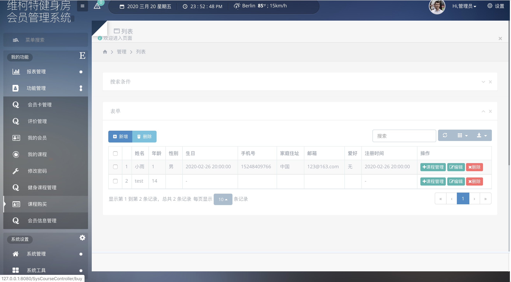

# 健康时代健身房管理系统的设计与实现

随着中国经济的不断发展以及人们日益增长的对美好生活的向往，越来越多的人们开始关注自己的身体健康情况，民众健身意识的逐渐提高促进了健身行业的兴起。在这一潮流之下，多种健身俱乐部在各地纷纷出现，但是我国的健身房管理信息系统研究相对于国外发达国家而言，起步较晚且发展不足。尤其对于建立在社区学校内的小型健身房，由于经费限制或管理者的信息化意识缺失，其管理工作长期处于纸质化或半纸质化的阶段，进而导致了管理效率低下、推广效果不佳。因此，亟需设计并实现一个健身房管理信息系统，便于提高管理效率、提升用户体验、辅助经营决策。
健康时代健身房是一家位于天津市内某小区周边的小型健身机构，服务对象主要是小区的住户，就该健身房整体来说规模较小。本课题拟为健康时代健身房设计一套较为规范完整的管理系统，便于加强管理者与会员之间的沟通，使会员的满意度可以及时得到反馈。利用越来越便利的网络条件将健身房信息化，将会员与管理者的需求进行计算机化的统一管理，从而为会员提供更好的服务，提高管理者的经营效率。
**主要内容：**
设计并实现一个基于B/S结构的健康时代健身房管理系统。开发工具为Java，采用面向对象的分析方法。使用对象包含会员、教练以及管理员。主要功能包括前台管理和后台管理。
前台管理包括：
1、用户注册登录模块；
2、用户管理模块：包含个人基本信息管理、
个人体能信息管理、身高，体重，bmi，体脂，肌肉，水分，蛋白质，骨量，性别，年龄
个人健身方案管理、
会员卡管理、
缴费管理；
3、私人订制课程管理：包含私人订制课程信息查询、
购买私课、课程预约；
4、评价与反馈管理：包含课程满意度调查、教练满意度调查、意见提交。
在我的课程里，可以点击教练满意调查，里面包含了对课程满意度

评价：类型，标题，满意度，意见，userid发表用户，

后台管理包括：
1、用户登录模块；
2、信息管理模块：包含会员管理、教练管理、报表管理、硬件管理、课程管理、评价管理；
3、系统设置：包含系统功能设置、数据库备份。

**目的和意义：**
设计并开发一套用于某小区内的小型健身房管理信息系统，旨在通过该系统使会员更方便、快捷地了解课程信息、场地信息、教练信息、健身效果、健身贴士等，使教练能实时掌握学员的健身状况、安排私教课程等，使健身房管理者能实时查看会员数量、教练业绩和反馈意见等。该系统的实现有助于丰富会员和教练的互动途径、提高会员的满意度、提高管理者的工作效率并为健身房的长期经营提供决策支持。

## 数据库文件需单独联系索要，具体请加QQ：641351484

